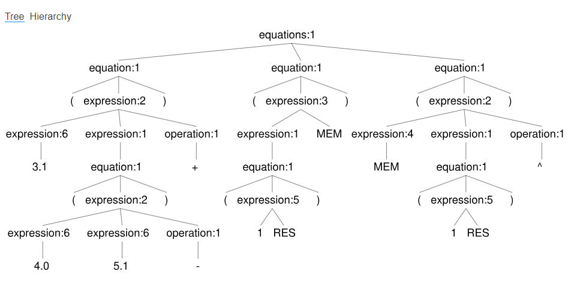
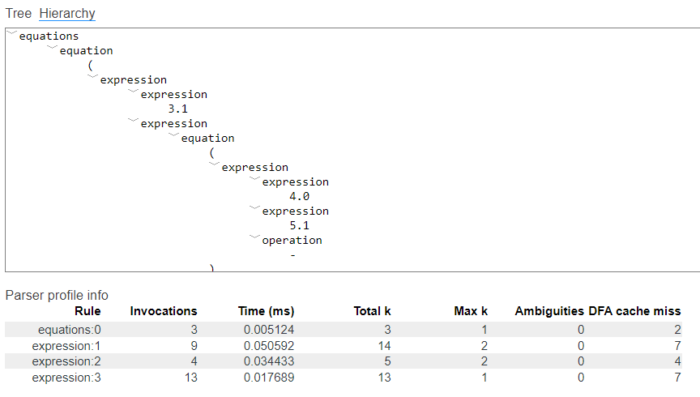
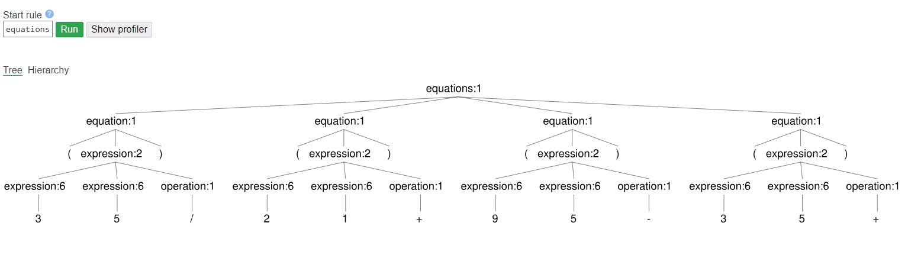
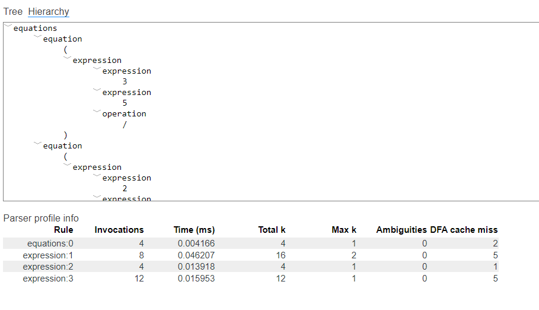
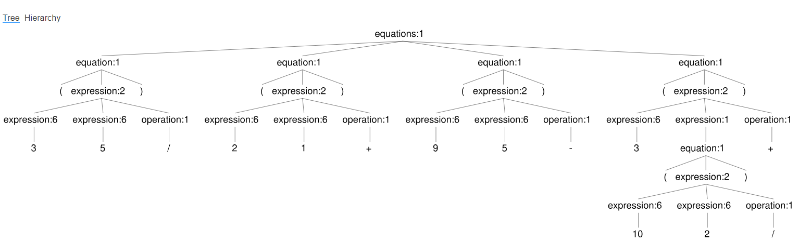
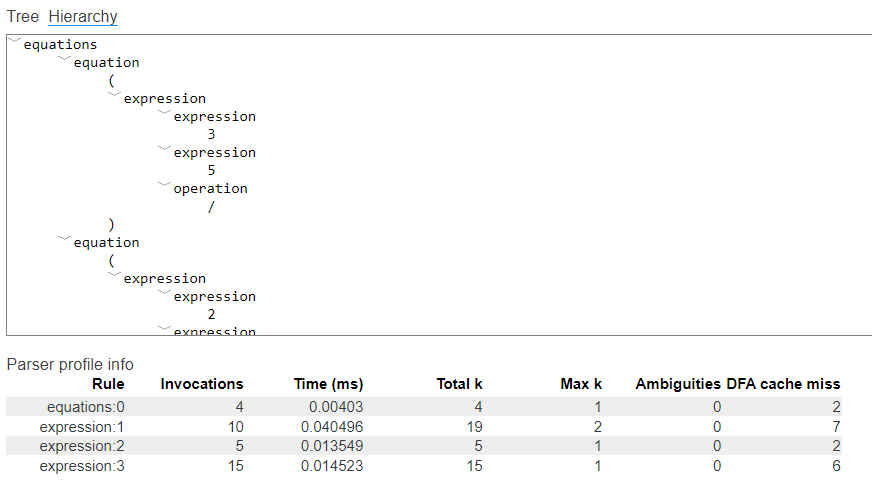

# Developed by: Julien Vinicius, Matheus Lucato and Paulo Zanetti
Work developed for the "Interpreter Construction" (Construção de Interpretadores) course taught by professor Frank Coelho at PUCPR.

The purpose of this work is the construction of a lexical analyzer developed in ANTLR4 for processing mathematical expressions.

# Preparing the environment:

- Provide the txt file with mathematical expressions of your choice
- Run npm install (to install the project dependencies - antlr4ts ; antlr4ts-cli)
- Run npm start (to run the main.ts file, this file has the methods for reading the txt, generating the lexer and, later, the parser and printing it)

At the end, we have an impression of the expressions with their respective trees and hierarchies, according to the images below.

# test 1

* Tree

* Hierarchy
  

# test 2

* Tree 2
  

* Hierarchy 2

# test 3

* Tree 3

* Hierarchy 3

